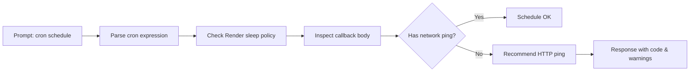
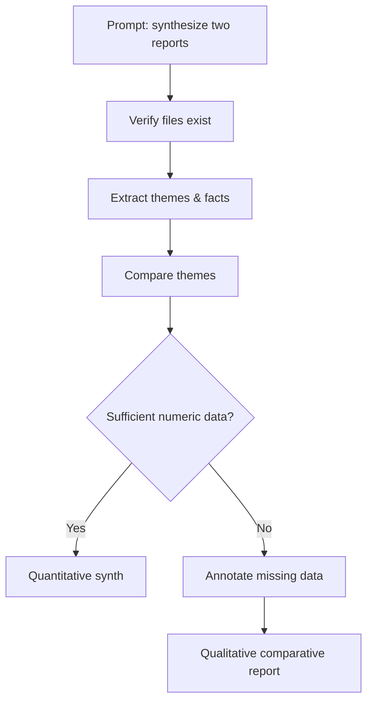
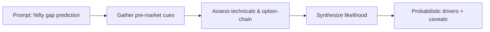
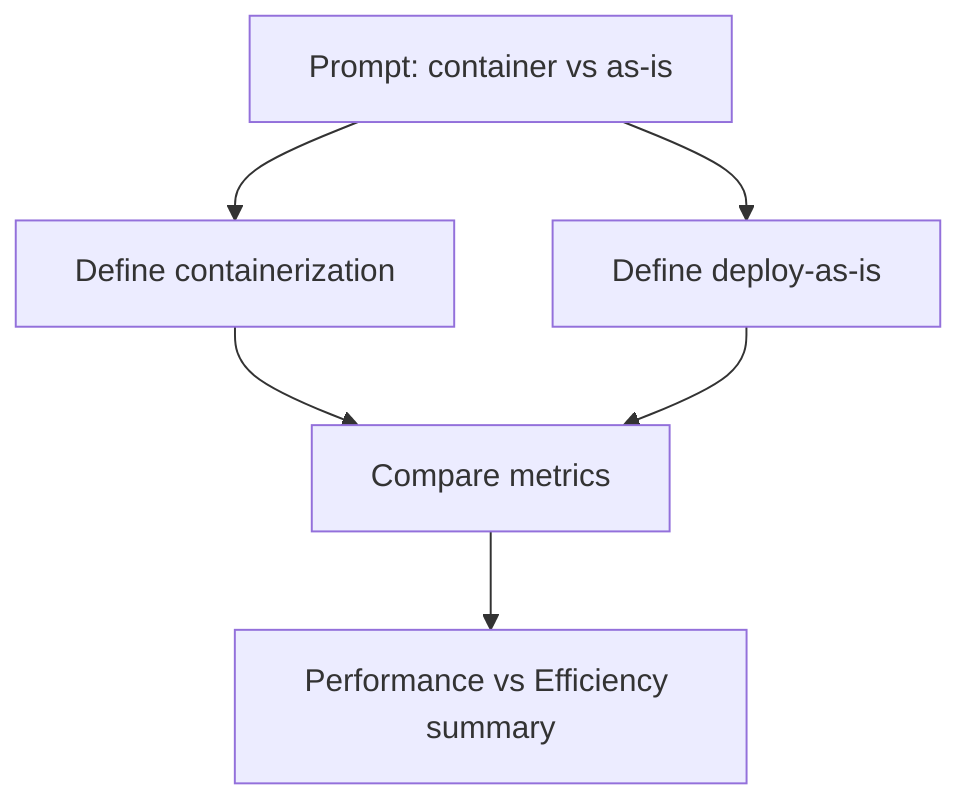

# AntiNode Case Studies — Structured Case Study Format

Each case study below is presented as: Prompt → Reasoning → Steps → Response. Visual flow uses mermaid.js.

---

## Case Study A — Agentic Document Retrieval (GreenLeaf)

Prompt

> "GreenLeaf_Logistics_Q3_2024_Report.txt, can you find this document form and make a detailed report out of it for a meeting so that i can ace it."

Reasoning

- User requested a specific file; vector similarity is fuzzy → require deterministic retrieval.
- Validate existence, metadata, and extract structured financial items.

Steps

1. Intent recognition → choose `searchByName`.
2. Deterministic DB lookup (Supabase/Pinecone) for filename.
3. Inject retrieved content into GlobalContextObject.
4. Synthesize meeting-ready report with highlights, metrics, and notes.
5. Flag missing data if details absent.

Response (synthesized)

- Title: GreenLeaf Logistics — Q3 2024 Fiscal Update (Meeting)
- Sections: Financial Highlights, Key Updates, Risks & Actions.
- Example metrics (from doc): Total Revenue, Net Income, Operating Margin.
- Sources: GreenLeaf_Logistics_Q3_2024_Report.txt
- Note: If numeric fields missing, report marks "data unavailable."

Mermaid

```mermaid
flowchart TD
    P[Prompt: filename request] --> R{Reasoning: need deterministic lookup}
    R --> S1[Select tool: searchByName]
    S1 --> DB[DB lookup (Supabase/Pinecone)]
    DB --> G[GlobalContextObject]
    G --> SYN[Synthesize report]
    SYN --> RESP[Meeting-ready Report]
```

---

## Case Study B — Neuro-Symbolic Logic Audit (Render cron keep‑alive)

Prompt

> "import cron from 'node-cron'; cron.schedule('_/14 _ \* \* \*', () => {}) is this setup enough to keep my server awake...?"

Reasoning

- Scheduler frequency must be compared to Render.com sleep window (15 min).
- A cron call alone doesn't ensure network activity; Render requires outgoing network pings.

Steps

1. Parse schedule → normalize to `*/14 * * * *`.
2. Verify Render free-tier sleep policy (15m).
3. Inspect callback body for network activity.
4. Recommend actionable fix (HTTP ping/health endpoint).

Response (synthesized)

- Status: Conditional Pass — schedule runs every 14 minutes (within 15m).
- Warning: Callback is empty — must perform a network request (e.g., fetch/HTTP GET) to register activity.
- Fix: Add a health ping (example snippet) and monitor success.

Mermaid



---

## Case Study C — Synthesis & Hallucination Prevention (Nebula vs GreenLeaf)

Prompt

> "Synthesize documents Nebuala\*AI_Q3_Report.txt and GreenLeaf_Logistics_Q3_2024_Report.txt and give a detailed report."

Reasoning

- Only high‑level contexts available; specific figures may be absent → avoid inventing data.
- Provide thematic comparison and explicitly state missing-data limitations.

Steps

1. Confirm presence of both documents.
2. Extract themes, sections, and any explicit figures.
3. Compare overlap (finance, operations, logistics).
4. If numeric data missing, mark as "insufficient data" and recommend follow-up.

Response (synthesized)

- Comparative summary by theme (Finance, Management, Operations).
- Side-by-side topical bullets.
- Explicit note: "No specific financial figures were provided — cannot perform detailed quantitative comparison."

Mermaid



---

## Case Study D — Market Question: Nifty 50 Opening Gap

Prompt

> "According to the market situation, what are the chances of Nifty 50 opening as gap up or gap down?"

Reasoning

- Predictive inference depends on global markets, SGX Nifty, futures, flows, macro news, technical zones.
- Present probabilistic drivers, not deterministic forecasts.

Steps

1. Gather pre-market cues: Gift Nifty, Asian/US session closes, futures, FII/DII flows, news.
2. Assess technical support/resistance and option-chain hints.
3. Synthesize directional likelihood and contributing factors.
4. Provide caveats and required live data points.

Response (synthesized)

- Drivers for gap-up: positive US close, rising SGX Nifty, bullish FII flows, positive macro news.
- Drivers for gap-down: weak Asian cues, negative global risk sentiment, adverse macro/company news.
- Recommendation: check Gift Nifty, pre-market futures, and overnight news; classify as "probability framework" rather than binary prediction.

Mermaid



---

## Case Study E — Containerization vs "Deploy as is"

Prompt

> "What is the difference between containerization and deploying a server as it is; does it affect performance or is it just efficiency?"

Reasoning

- Compare abstraction level, resource overhead, startup, isolation, portability.
- Distinguish direct performance impact vs efficiency benefits that enable better performance.

Steps

1. Define both approaches.
2. Compare resource usage, isolation, startup time, portability.
3. State performance & efficiency tradeoffs and typical use cases.

Response (synthesized)

- Containerization: lightweight, shares host kernel, faster startup, higher density, portable.
- Deploy-as-is (bare‑metal/VM): full OS per instance, stronger OS-level isolation, higher overhead.
- Effect on performance: usually neutral-to-positive — containers reduce overhead and enable faster scaling; primary gain is efficiency, which often yields better practical performance.
- When to choose: containers for microservices/CI‑CD/scale efficiency; VMs/bare-metal for strong isolation or legacy OS needs.

Mermaid



---

End note: Each response highlights provenance, explicit data gaps, and actionable next steps for follow‑up data retrieval, although these response have been shortend for easy understanding because the original response were very detailed and long.
